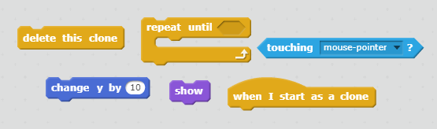

## صواعق برقية

لنُضِف إمكانية إطلاق الصواعق البرقية إلى سفينة الفضاء!

+ أضف الكائن `Lightning` من مكتبة Scratch.  

+ عندما تبدأ اللعبة، يجب أن يكون الكائن `Lightning` مخفيًا حتى تطلق السفينة قذائف الليزر، لذا أضف هذه التعليمة البرمجية إلى الكائن `Lightning`:

```blocks
  when green flag clicked
  hide
```


أصبح لسفينتك الآن إمكانية إطلاق صواعق برقية عملاقة ومتوهجة!

+ أدخل بعض التعليمات البرمجية أسفل الكتل البرمجية التي أضفتها للتو لتصغير الكائن `Lightning` وقلبِه. عندئذٍ ستبدو السفينة وكأنها تطلق قذائف موزَّعة.

```blocks
set size to (25) %
point in direction (-90 v)
```

+ انتقل إلى الكائن `Spaceship` بالنقر عليه بقائمة الكائنات الموجودة أسفل المنصة.

+ أضف بعض التعليمات البرمجية الجديدة لتجعل الكائن `Spaceship` يُطلق صاعقة برقية جديدة في أي وقت يتم فيه الضغط على مفتاح **المسافة**.

--- hints ---
--- hint ---
إليك بعض التعليمات البرمجية المستعارة لتستخدمها:

عند النقر على العلم الأخضر
تحقق باستمرار
إذا تم الضغط على مفتاح **المسافة**، فأنشئ نسخة من الكائن `Lightning`
--- /hint ---
--- hint ---
فيما يلي القالبان اللذان ستحتاج إليهما:


--- /hint ---
--- hint ---
هذه هي التعليمة البرمجية التي ستحتاج إليها:

```blocks
when flag clicked
forever
	if <key [space v] pressed?> then
		create clone of [Lightning v]
	end
end
```
--- /hint ---
--- /hints ---

+ عُد إلى الكائن `Lightning` مرة أخرى.

+ متى تم إنشاء صاعقة برقية، يجب أن تظهر ثم تتحرك إلى أعلى حتى تصل إلى أعلى الشاشة. ثم يجب أن تختفي.

--- hints ---
--- hint ---

عندما تظهر نسخة جديدة من الكائن `Lightning`:
- أظهرها
- حرِّكها بمقدار `10` إلى أعلى بشكل متكرِّر حتى تلامس حافة الشاشة
- ثم احذف النسخة
--- /hint ---
--- hint ---
فيما يلي القالبان اللذان ستحتاج إليهما:


--- /hint ---
--- hint ---
هذه هي التعليمة البرمجية التي ستحتاج إلى إضافتها إلى الكائن `Lightning`:

```blocks
	when I start as a clone
    show
	repeat until <touching [edge v] ?>
		change y by (10)
	end
	delete this clone
```
--- /hint ---
--- /hints ---


+ اختبر الكائن `Lightning` بالنقر على العلم الأخضر ثم الضغط على مفتاح **المسافة**. عندما تضغط على مفتاح **المسافة**، هل تظهر صاعقة برقية على الشاشة وتتحرك إلى أعلى؟ ما المشكلة التي يمكن أن تكتشفها؟

--- collapse ---
---
title: الإجابة
---
يوجد خطأ — إلى الآن، تُطلق الصواعق البرقية من المكان نفسه دائمًا، بغض النظر عن مكان سفينة الفضاء!

أضف هذه القالب قبل القالب `أظهر`{:class="blocklooks"} مباشرة لتجعل نسخة الكائن `Lightning` تتحرك إلى موقع الكائن `Spaceship` قبل أن تظهر. وبذلك، ستبدو الصاعقة البرقية وكأنها تُطلق من سفينة الفضاء.

```blocks
go to [Spaceship v]
```

--- /collapse ---

+ اضغط على مفتاح **المسافة** لتختبر ما إذا كانت الصواعق البرقية تُطلق الآن من مكانها الصحيح أم لا.

--- challenge ---
### التحدي: تنظيم ظهور الصواعق البرقية
ماذا يحدث إذا ضغطت مطولًا على مفتاح **المسافة**؟ هل يمكنك أن تستخدم قالب `انتظر`{:class="blockcontrol"} لتنظيم ذلك؟

--- /challenge ---
