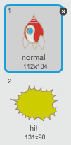

## انفجار سفينة الفضاء

عندما يلمس فرس سفينة الفضاء، يجب أن تنفجر السفينة!

+ حدِّد الكائن `Spaceship` وأعد تسمية مظهره إلى 'عادي'.

+ ارسم مظهرًا آخر لسفينة فضاء تنفجر وسمِّه 'اصطدام'.



أو إذا كنت لا تريد أن ترسم مظهر الانفجار، يمكنك أن تختار المظهر 'Sun' من مكتبة Scratch، وتستخدم أداة **تلوين شكل** لتغيير لونه وإزالة الوجه.


+ أضف بعض التعليمات البرمجية إلى الكائن `Spaceship` بحيث يبدأ في إظهار مظهر سفينة الفضاء العادي، لكن عندما تصطدم السفينة بفرس، تتحول إلى المظهر 'اصطدام':

```blocks
when flag clicked
switch costume to [normal v]
wait until <touching [Hippo1 v]>?
switch costume to [hit v]
```

+ اختبر التعليمة البرمجية بتشغيل اللعبة والاصطدام بفرس. هل تتغير سفينة الفضاء إلى المظهر 'اصطدام'؟
