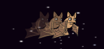

## خفاش الفاكهة

لزيادة مستوى صعوبة اللعبة، لننشئ خفاش فاكهة يرمي برتقالًا على سفينة الفضاء.

+ أضف كائن `Bat` وعيِّن أسلوب دورانه **إلى اليسار–إلى اليمين** فقط.

+ اجعل الكائن `Bat` `يتحرك`{:class="blockmotion"} من جانب إلى آخر أعلى المنصة ضمن حلقة `كرِّر باستمرار`{:class="blockcontrol"}. تذكَّر أن تختبر التعليمة البرمجية.



--- hints ---
--- hint ---
عند النقر على العلم، يجب أن يفعل الكائن `Bat` الأمرَين التاليَين باستمرار
- يتحرك 10 خطوات
- يرتدّ إذا وصل إلى الحافة
--- /hint ---
--- hint ---
هذه هي التعليمة البرمجية التي ستحتاج إليها:

```blocks
when flag clicked
forever
    move (10) steps
    if on edge, bounce
end
```
--- /hint ---
--- /hints ---

إذا نظرتَ إلى مظهرَي الخفاش، فستجد أنهما مختلفان بالفعل:


+ استخدم القالب `المظهر التالي`{:class="blocklooks"} لتجعل الخفاش يضرب بجناحيه أثناء تحركه.

--- hints ---
--- hint ---
بعد أن يتحرك الخفاش، يجب أن يُظهر `المظهر التالي`{:class="blocklooks"} ثم `ينتظر`{:class="blockcontrol"} لفترة قصيرة.
--- /hint ---
--- hint ---
هذه هي التعليمة البرمجية التي ستحتاج إليها:

```blocks
next costume
wait (0.3) secs
```
--- /hint ---
--- hint ---
هذه هي التعليمات البرمجية الكاملة بعد إضافة التعليمة البرمجية الجديدة:

```blocks
when flag clicked
forever
    move (10) steps
    if on edge, bounce
    next costume
    wait (0.3) secs
end
```
--- /hint ---
--- /hints ---

والآن، لنجعل الخفاش يرمي البرتقال.

+ أضف كائن `Orange` جديدًا من مكتبة Scratch.


+ أضف تعليمة برمجية إلى الخفاش بحيث ينتظر، عندما يتم النقر على العلم، لوقت عشوائي من 5 إلى 10 ثوان ثم ينشئ نسخة من الكائن `Orange`.

--- hints ---
--- hint ---
انظر إلى التعليمة البرمجية التي كتبتَها عندما أنشأتَ الكائن `Lightning`. إنها مشابهة جدًا للتعليمة البرمجية التي تحتاج إليها الآن، باستثناء ظهور برتقالة عندما تضغطُ على مفتاح **المسافة**، والتي يجب أن تظهر بعد `الانتظار`{:class="blockcontrol"} لمدة `5-10`{:class="blockoperators"} ثانية.
--- /hint ---
--- hint ---
`عند النقر على العلم`{:class="blockcontrol"}، يجب أن ينفِّذ الكائن `Bat` الأمرَين التاليَين في حلقة
`كرِّر باستمرار`{:class="blockcontrol"}
- `ينتظر`{:class="blockcontrol"} لمدة `عشوائية`{:class="blockoperators"} من `5 إلى 10`{:class="blockoperators"} ثانية
- `يُنشئ نسخة`{:class="blockcontrol"} من الكائن `Orange`
--- /hint ---
--- hint ---
هذه هي التعليمة البرمجية التي ستحتاج إليها:

```blocks
when flag clicked
forever
	wait (pick random (5) to (10)) secs
	create clone of [Orange v]
end
```
--- /hint ---
--- /hints ---

+ انقر على الكائن `Orange` وأضف بعض التعليمات البرمجية لتجعل كل نسخة من الكائن `Orange` تسقط من موقع الكائن `Bat` وتتجه إلى أسفل المنصة.

--- hints ---
--- hint ---
هذه التعليمة البرمجية التي تحتاج إليها هي غالبًا التعليمة البرمجية نفسها الموجودة داخل الكائن `Lightning`، باستثناء أن الكائن `Orange` يجب أن `ينتقل إلى`{:class="blockmotion"} موقع الكائن `Bat`، ويجب أن يستخدم القالب`غيِّر y بمقدار`{:class="blockcontrol"} للتحرك إلى أسفل بدلًا من إلى أعلى.
--- /hint ---
--- hint ---
هذه هي التعليمة البرمجية التي ستحتاج إليها:

```blocks
	when flag clicked
	hide

	when I start as a clone
	go to [Bat1 v]
	show
	repeat until <touching [edge v]?
		change y by (-4)
	end
	delete this clone

```
--- /hint ---
--- /hints ---


+ أضف بعض التعليمات البرمجية الأخرى إلى الكائن `Orange` بحيث عندما يصطدم الكائن `Spaceship`، يختفي هو الآخر ليعطي اللاعب فرصة لاستعادة القوة:

```blocks
	when I receive [hit v]
	delete this clone
```

+ ستحتاج أيضًا إلى تعديل التعليمة البرمجية في الكائن `Spaceship` بحيث يصطدم عندما يلامس كائن `Hippo` أو كائن `Orange`:

```blocks
	wait until < <touching [Hippo1 v]?> or <touching [Orange v]?>>
```

+ اختبر لعبتك. ماذا سيحدث إذا اصطدمت السفينة ببرتقالة ساقطة؟
