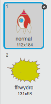

## Hipopotamws yn hedfan yn y gofod

Fe awn ati i ychwanegu hipopotamws sy'n hedfan ac yn ceisio dinistrio dy long ofod.

+ Bydd angen creu ciplun newydd o'r llun 'Hippo1' yn llyfrgell Scratch.

	

+ Gosod ei steil cylchdroi i chwith-dde yn unig, ac ychwanega'r côd canlynol i guddio'r ciplun pan fydd y gêm yn dechrau:

	```blocks
		pan fo ⚑ wedi ei glicio
		cuddio
	```

+ Bydd angen creu newidyn newydd o'r enw `cyflymder`{:class="blockdata"}, sydd ar gyfer ciplun yr hipopotamws yn unig.

	

	Fe fyddi di'n gwybod os wyt ti wedi gwneud hyn yn gywir gan y bydd gan y newidyn enw'r ciplun drws nesa iddo, fel hyn:

	

+ Bydd y côd yma yn creu hipo newydd bob ychydig o eiliadau. Mae'r **Llwyfan** yn lle da ar gyfer y côd yma:

	```blocks
		pan fo ⚑ wedi ei glicio
			am byth
   		aros (dewis ar hap (2) i (4)) eiliad
   		creu clôn o [Hippo1 v]
		end
	```

+ Pan fydd clôn pob hipo yn cychwyn, symud e o gwmpas y llwyfan (ar gyflymder ar hap) tan ei fod yn cael ei daro gan fellten. Ychwanega'r côd yma i giplun *yr hipo*:

	```blocks
		pan dechreuaf fel clôn
			gosod [cyflymder v] i (dewis ar hap (2) i (4))
			mynd i x:(dewis ar hap (-220) i (220)) y:(150)
		dangos
			ailwna hyd at <cyffwrdd [lightning v]?>
   			symud (speed) cam
   			troi ↻ (dewis ar hap (-10) i (10)) gradd
   			os ar ymyl, bowndio
		end
		dileu y clôn hwn
	```

+ Profa gôd yr hipo.  Fe ddyle ti weld clôn newydd yn ymddangos ar gyfer yr hipo bob ychydig o eiliadau, gyda phob un yn symud ar gyflymder ei hunan.

	

+ Profa y laser. Os wyt ti'n taro hipo, ydy e'n diflannu?

+ Pan mae hipo yn cyffwrdd dy long ofod, mae angen i ni wneud i dy long ofod ffrwydro! I wneud hyn, bydd angen i ti greu 2 wisg ar gyfer dy long ofod sef 'normal' a 'ffrwydro'.

	

	Mae modd creu y wisg 'ffrwydro' trwy ddefnyddio'r ddelwedd 'Haul' o lyfrgell Scratch, a defnyddio 'Lliwio siâp' i newid ei liw.

	

+ Ychwanega'r côd yma i dy long ofod fel ei fod yn newid gwisg pryd bynnag mae'n taro hipo sy'n hedfan:

	```blocks
		pan fo ⚑ wedi ei glicio
			am byth
   			newid i wisg [normal v]
   			aros hyd at <cyffwrdd [Hippo1 v]?>
   			newid i wisg [ffrwydro v]
   			darlledu [ffrwydro v]
   			aros (1) eiliad
		end
	```

+ A wnes di sylwi dy fod di wedi darlledu neges 'ffrwydro' yn y côd uchod? Mae modd defnyddio'r neges yma i wneud i bob hipo ddiflannu pan mae'r llong ofod yn cael ei daro.

	Ychwanega'r côd yma i'r hipo:

	```blocks
		pan dderbyniaf [ffrwydro v]
		dileu y clôn hwn
	```

+ Profa'r côd yma trwy ddechrau gêm newydd a tharo hipo.

	

--- challenge ---
### Her: Bywydau a Sgôr
Wyt ti'n gallu ychwanegu `bywydau`{:class="blockdata"}, `sgôr`{:class="blockdata"} neu hyd yn oed `sgôr uchel`{:class="blockdata"} i dy gêm? Fe alli di ddefnyddio prosiect 'Dal y dotiau' i dy helpu.

--- /challenge ---
