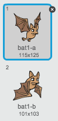

## Ystlumod Ffrwythau!

Fe awn ati i greu ystlum ffrwythau sydd yn taflu orennau at dy long ofod.

+ Yn gyntaf, bydd angen creu ciplun ystlum fydd yn `symud`{:class="blockmotion"} ar draws top y llwyfan `am byth`{:class="blockcontrol"}. Cofia brofi'r côd.

	

+ Os wyt ti'n edrych ar wisgoedd yr ystlum, fe weli di fod yna 2 yn barod:

	

	Defnyddia'r bloc `gwisg nesaf`{:class="blocklooks"} i wneud i'r ystlum symud ei adenydd pan mae'n symud.

+ Bydd angen creu ciplun 'Oren' o lyfrgell Scratch.

	


+ Ychwanega côd i dy ystlum fel ei fod yn creu clôn oren newydd bob ychydig o eiliadau.

	```blocks
		pan fo ⚑ wedi ei glicio
			am byth
   			aros (dewis ar hap (5) i (10)) eiliad
   			creu clôn o [Orange v]
		end
	```

+ Clicia ar dy giplun oren ac ychwanega'r côd yma i wneud i bob clôn oren gwympo lawr y llwyfan o'r ystlum tuag at y llong ofod:

	```blocks
		pan fo ⚑ wedi ei glicio
		cuddio

		pan dechreuaf fel clôn
			mynd i [Bat1 v]
			dangos
		ailwna hyd at <cyffwrdd [ymyl v]?>
  			newid y gan (-4)
		end
			dileu y clôn hwn

		pan dderbyniaf [ffrwydro v]
		dileu y clôn hwn
  ```

+ Bydd angen i ti newid y côd yn y ciplun llong ofod, fel ei fod yn ffrwydro pan mae'r hipo neu oren yn ei gyffwrdd:

	```blocks
		aros hyd at <<cyffwrdd [Hippo1 v]?> neu <cyffwrdd [Orange v]?>>
	``` 

+ Profa dy gêm.  Beth sy'n digwydd os wyt ti'n cael dy daro gan oren?
