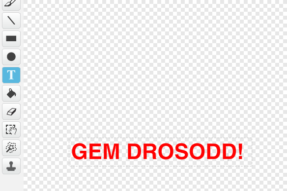

## Gêm drosodd

Fe awn ati i ychwanegu neges 'Gêm drosodd' i ddiwedd y gêm.

+ Os nad wyt ti wedi gwneud yn barod, bydd angen creu newidyn neydd o'r enw `bywydau`{:class="blockdata"}. Fe ddylai dy long ofod ddechrau gyda 3 bywyd a colli bywyd pryd bynnag mae'r gelyn yn ei gyffwrdd.  Fe ddylai dy gêm hefyd ddod i ben pan nad oes bywydau ar ôl. Os wyt ti angen cymorth, fe fydd y prosiect 'Dal dotiau' yn dy helpu di.

+ Llunia ciplun newydd o'r enw 'Gêm Drosodd', gan ddefnyddio'r teclyn testun.

	

+ Ar dy lwyfan, darlleda neges `gêm drosodd`{:class="blockevents"} cyn i'r gêm orffen.

	```blocks
		darlledu [gêm drosodd v] ac aros
	```

+ Ychwanega'r côd yma i dy giplun 'Gêm Drosodd' fel bod y neges yn ymddangos ar ddiwedd y gêm:

	```blocks
		pan fo ⚑ wedi ei glicio
			cuddio

		pan dderbyniaf [gêm drosodd v]
			dangos
	```

	Gan dy fod di wedi defnyddio bloc `darlledu [gêm drosodd] ac aros`{:class="blockevents} ar dy lwyfan, bydd yn aros i'r ciplun 'Gêm drosodd' ymddangos cyn gorffen y gêm.

+ Profa dy gêm. Faint o bwyntiau alli di sgorio? Wyt ti'n gallu meddwl am ffyrdd o wella dy gêm os yw'n rhy hawdd neu anodd?
