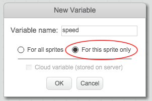
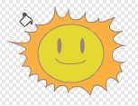

## Fliegende Weltraum-Nilpfherde

Lass uns jetzt ganz viele, fliegende Weltraum-Nilpferde, die versuchen, dein Raumschiff zu zerstören, hinzufügen.

+ Erstelle ein neues Sprite vom 'Hippo1' (Nilpferd 1) Bild in der Scratch Bibliothek.

	

+ Stelle dessen Rotationsstil so ein, dass es sich nur links-rechts drehen kann und füge den folgenden Code hinzu, um das Sprite zu verstecken, wenn das Spiel beginnt:

	```blocks
		Wenn die grüne Flagge angeklickt
		verstecke dich
	```

+ Erstelle eine neue Variable namens `speed`{:class="blockdata"} (Geschwindigkeit), die nur für das Nilpferd- Sprite gedacht ist.

	

	Du wirst wissen, ob du es richtig gemacht hast, weil der Name für die Variable des Sprites daneben stehen wird:

	

+ Der folgende Code erzeugt alle paar Sekunden ein neues Nilpferd. **The Stage** (Das Stadium) ist ein guter Platz zur Aufbewahrung dieses Codes:

	```blocks
		Wenn die grüne Flagge angeklickt
		wiederhole fortlaufend
  			warte (Zufallszahl von (2) bis (4)) Sek.
   			erzeuge Klon von [Hippo1 v]
		Ende
	```

+ Wenn jeder Nilpferd-Klon beginnt, lasse ihn sich (bei zufällig ausgewählter Geschwindigkeit) rund herum um das Stadium bewegen bis das Nilpferd vom Blitz getroffen wird. Füge diesen Code **to the hippo**  (zum Nilpferd) Sprite hinzu:

	```blocks
		Wenn ich als Klon entstehe
		setze [speed v] auf (Zufallszahl von (2) bis (4))
		gehe zu x:(Zufallszahl von (-220) bis (220)) y:(150)
		zeige dich
		wiederhole bis <wird [lightning v] berührt?>
   			gehe (speed) er-Schritt
   			drehe dich nach rechts um (Zufallszahl von (-10) bis (10)) Grad
  			 pralle vom Rand ab
		Ende
		lösche diesen Klon
	```

+ Teste deinen Nilpferd-Code. Du solltest alle paar Sekunden einen neuen Nilpferd-Klon sehen können, jeder davon bewegt sich zu seiner eigenen Geschwindigkeit.

	

+ Teste deine Laser-Kanone. Wenn du ein Nilpferd triffst, verschwindet es dann?

+ Wenn ein Nilpferd dein Raumschiff berührt, müssen wir dein Raumschiff dazu bringen, dass es explodiert! Um dies zu erreichen, müssen wir als erstes gewährleisten, dass dein Raumschiff 2 Kostüme namens 'normal' (normal) und 'hit' (wurde getroffen) hat.

	

	Das 'hit' (wurde getroffen) Kostüm des Raumschiffs kann erstellt werden durch den Import des 'Sun' (Sonne) Bildes aus der Scratch Bibliothek und anschließend das 'Color a shape' (eine Form bemalen) Tool benutzen, um dessen Farbe zu ändern.

	

+ Füge diesen Code zu deinem Raumschiff hinzu, damit  es jedes Mal, wenn es mit einem fliegenden Nilpferd zusammenstößt, sein Kostüm ändert:

	```blocks
		Wenn die grüne Flagge angeklickt
		wiederhole fortlaufend
   			wechsle zu Kostüm [normal v]
   			warte bis <wird [Hippo1 v] berührt?>
   			wechsle zu Kostüm [hit v]
   			sende [hit v] an alle
   			warte (1) Sek.
		Ende
	```

+ Hast du bemerkt, dass du in dem o.g. Code eine 'hit' (wurde getroffen) Meldung gesendet hast? Du kannst diese Meldung benutzen, um alle Nilpferde verschwinden zu lassen, wenn das Raumschiff getroffen wurde.

	Füge diesen Code zu deinem Nilpferd hinzu:

	```blocks
		Wenn ich [hit v] empfange
		lösche diesen Klon
	```

+ Teste diesen Code, indem du ein neues Spiel beginnst und mit einem Nilpferd kollidierst. 

	

--- challenge ---

## Aufgabe: Leben und Punktzahl 
Kannst du `lives`{:class="blockdata"} (Leben), `score`{:class="blockdata"} (Punktzahl) oder sogar eine `highscore`{:class="blockdata"} (hohe Punktzahl) zu deinem Spiel hinzufügen? Du kannst das 'Catch the Dots' (Fang die Punkte) Projekt als Hilfestellung hierfür benutzen.

--- /challenge ---
