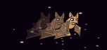

## Flughunde!

Lass uns einen Flughund kreieren, der Orangen auf dein Raumschiff wirft.

+ Lass uns als erstes ein neues Fledermaus-Sprite herstellen, das sich  `forever`{:class="blockcontrol"} (für immer) über dem oberen Teil des Stadiums `move`{:class="blockmotion"} (bewegt).  Denke daran, deinen Code zu testen!

	

+ Wenn du dir die Kostüme der Fledermaus ansiehst, wirst du sehen, dass sie bereits 2 hat:

	

	Benutze den `next costume`{:class="blocklooks"} (nächstes Kostüm) Block, damit die Fledermaus mit den Flügeln schlägt, während sie sich bewegt.

+ Erstelle in der Scratch Bibliothek ein neues 'Orange' Sprite.

	


+ Füge den Code für deine Fledermaus hinzu, damit sie alle paar Sekunden einen neuen, orange-farbenen Klon herstellt.

	```blocks
		Wenn die grüne Flagge angeklickt
		wiederhole fortlaufend
  			warte (Zufallszahl von (5) bis (10)) Sek.
   			erzeuge Klon von [Orange v]
		Ende
	```

+ Klicke auf dein orange-farbenes Sprite und füge diesen Code hinzu, damit jeder orange-farbene Klon das Stadium von der Fledermaus zum Raumschiff hin hinunterfällt:

	```blocks
		Wenn die grüne Flagge angeklickt
		verstecke dich

		Wenn ich als Klon entstehe
		gehe zu [Bat1 v]
		zeige dich
		wiederhole bis <wird [Rand v] berührt?>
  			ändere y um (-4)
		Ende
		lösche diesen Klon

		Wenn ich [hit v] empfange
		lösche diesen Klon
	```

+ In deinem Raumschiff-Sprite musst du deinen Code modifizieren, damit du getroffen wirst, wenn du ein Nilpferd oder eine Orange berührst:

	```blocks
		warte bis <<wird [Hippo1 v] berührt?> oder <wird [Orange v] berührt?>>
	``` 

+ Teste dein  Spiel. Was passiert, wenn du von einer herabfallenden Orange getroffen wirst?
