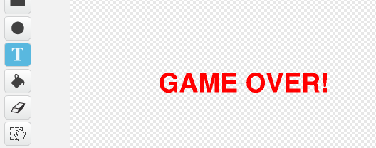

## Game Over

Lass uns eine 'game over' (Spiel-Ende) Meldung zum Ende des Spiel hinzufügen.

+ Falls du es noch nicht getan hast, musst du jetzt eine neue Variable namens `lives`{:class="blockdata"} (Leben) erstellen. Dein Raumschiff sollte mit 3 Leben starten und immer ein Leben verlieren, sobald es mit einem Feind zusammenstlößt. Dein Spiel sollte ebenfalls beendet werden, sobald du alle deine Leben verloren hast. Wenn du hierbei Hilfestellung benötigst, kannst nochmal in das 'Catch the Dots' (Fang die Punkte) Projekt schauen.

+ Zeichne ein neues Sprite namens 'Game Over' mit Hilfe des Text Tools.

	

+ Sende eine `game over`{:class="blockevents"} Meldung in deinem Stadium kurz bevor das Spiel aus ist.

	```blocks
		sende [game over v] an alle und warte
	```

+ Füge diesen Code zu deinem 'Game Over' Sprite hinzu, damit die Meldung bei Spiel-Ende angezeigt wird:

	```blocks
		Wenn die grüne Flagge angeklickt
		verstecke dich

		Wenn ich [game over v] empfange
		zeige dich
	```

	Weil du einen Block mit `broadcast [ Game over] and wait`{:class="blockevents"} (Game Over und Warten Meldung) in deinem Stadium benutzt hast, wird es darauf warten, dass das 'Game Over' Sprite angezeigt wird, ehe das Spiel beendet wird.

+ Teste dein  Spiel. Wie viele Punkte kannst zu erzielen? Kannst du an Wege denken, dein Spiel zu verbessern, falls es zu einfach oder zu schwer sein sollte?
