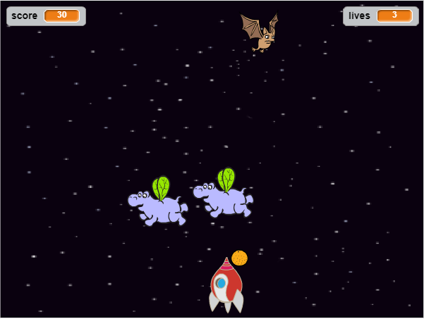

--- no-print ---

This is the **Scratch 2** version of the project. There is also a [Scratch 3 version of the project](https://projects.raspberrypi.org/en/projects/clone-wars).

--- /no-print ---

## Introduction

In this project you will learn how to create a game in which you have to save the Earth from space monsters.

### What you will make

--- no-print ---

Click the green flag in the example game below to start, and then press the <kbd>left</kbd> and <kbd>right</kbd> arrow keys to move the spaceship, and the <kbd>space</kbd> key to shoot.

  <iframe allowtransparency="true" width="485" height="402" src="https://scratch.mit.edu/projects/embed/251794419/?autostart=false" frameborder="0"></iframe>
  

--- /no-print ---

Score as many points as you can by shooting flying space-hippos. If you get hit by a hippo or by an orange dropped by the bats, you lose a life.

--- print-only ---

--- /print-only ---

--- collapse ---

---
title: What you will need
---

### Hardware

+ A computer capable of running Scratch 2.0

### Software

+ Scratch 2.0 [offline](https://rpf.io/scratchoff){:target="_blank"}

### Downloads

[Find the downloads here](http://rpf.io/p/en/clone-wars-scratch2-go).

--- /collapse ---

--- collapse ---

---
title: What you will learn
---

+ How to make sprites move using keyboard input
+ How to clone sprites to make copies of them
+ How to use 'broadcast' and 'receive blocks' to send messages

--- /collapse ---

--- collapse ---

---
title: Additional notes for educators
---

--- no-print ---

If you need to print this project, please use the [printer-friendly version](https://projects.raspberrypi.org/en/projects/clone-wars-scratch2/print){:target="_blank"}.

--- /no-print ---

[If you need the solution to this project, you can find it here](http://rpf.io/p/en/clone-wars-scratch2-get){:target="_blank"}.

--- /collapse ---

