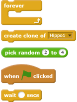
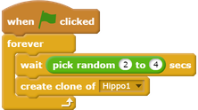
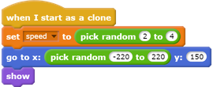
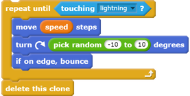
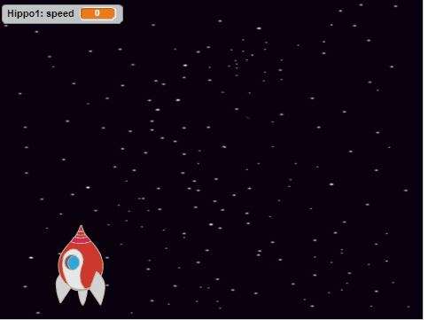

## Space-hippos

Now you're going to add lots of flying hippos that try to destroy your spaceship.

--- task ---

Create a new sprite with the 'Hippo1' image in the Scratch library. Use the **shrink** tool to make the `Hippo` sprite a similar size to the `Spaceship` sprite.

--- /task ---

--- task ---

Set the `Hippo` sprite's rotation style to **left-right**.

[[[generic-scratch-sprite-rotation-style]]]

--- /task ---

--- task ---

Add some code to hide the `Hippo` sprite when the game starts.

--- /task ---

--- task ---

Add some code to the Stage to create a new `Hippo` clone every few seconds.

--- hints ---

--- hint ---

When the `green flag is clicked`{:class="blockevents"}, `repeatedly`{:class="blockcontrol"} `wait`{:class="blockcontrol"} `between 2 and 4 seconds`{:class="blockoperators"} and then `create a clone of the Hippo sprite`{:class="blockcontrol"}.

--- /hint ---

--- hint ---

Here are the blocks you need:

--- /hint ---

--- hint ---

This is what your code should look like:

--- /hint ---

--- /hints ---

--- /task ---

Each new hippo clone should appear at a random `x` position, and every clone should have a random speed.

--- task ---

Create a new variable called `speed`{:class="blockdata"} that is for the `Hippo` sprite only.

[[[generic-scratch-add-variable]]]

When you've done this correctly, the variable has the name of the sprite next to it, like this:

--- /task ---

--- task ---

When each `Hippo` clone starts, pick a random speed and starting place for it. Then show the clone on the screen.

--- /task ---

--- task ---

Test your code. Does a new hippo appear every few seconds?

--- /task ---

At the moment the hippos don't move.

--- task ---

Each hippo should move around randomly until it gets hit by a lightning bolt. To make that happen, attach this code below the blocks that are already in the `Hippo` sprite's code script:

--- /task ---

--- task ---

Test your code again. You should see a new hippo clone appear every few seconds, and each clone should move at a different speed.

--- /task ---

--- task ---

Now test the spaceship's laser cannon. If a lightning bolt hits a hippo, does the hippo vanish?

--- /task ---

