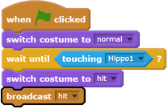
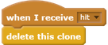
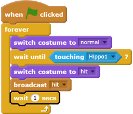

## Hippos that disappear

When the spaceship explodes, all the hippos should disappear so that players of the game can recover.

--- task ---

Add code to the spaceship sprite to make it `broadcast`{:class="blockevents"} the message "hit" when the `spaceship touches a hippo`{:class="blocksensing"}.

--- /task ---

--- task ---

All of the `Hippo` sprite clones will receive the "hit" message, and you can instruct them to disappear when the spaceship is hit by adding this code to the `Hippo` sprite:

--- /task ---

--- task ---

To check whether the new code works, click the green flag and make the spaceship collide with a hippo.

--- /task ---

After the spaceship explodes, new `Hippo` clones appear, but the spaceship is still exploded! The spaceship needs to reset itself after being hit.

--- task ---

Add a `wait`{:class="blockcontrol"} block at the end of the `Spaceship` sprite's code to create a small pause before hippos begin appearing again. Then add a `forever`{:class="blockcontrol"} block around all of your code to make the code run repeatedly.

--- /task ---

