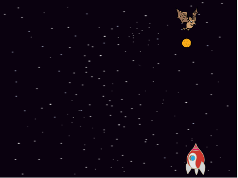

## Space-bat

To make your game a bit harder, you are going to create a bat that throws oranges at the spaceship.

--- task ---

Add a `Bat` sprite and set its rotation style to **left–right**.

--- /task ---

--- task ---

Make the `Bat` sprite `move`{:class="blockmotion"} from left to right at the top of the Stage `forever`{:class="blockcontrol"}. 

Remember to test your code.

--- /task ---

If you look at the bat's costumes, you can see that it has two different ones:

--- task ---

Use the `next costume`{:class="blocklooks"} block to make the bat flap its wings as it moves.

--- hints ---

--- hint ---

After the bat has moved, it should show the `next costume`{:class="blocklooks"} and then `wait`{:class="blockcontrol"} for a short time.

--- /hint ---

--- hint ---

You need to add these blocks to you code:

--- /hint ---

--- hint ---
You code should look like this:

--- /hint ---

--- /hints ---

--- /task ---

Now make the bat throw oranges!

--- task ---

Add an `Orange` sprite from the Scratch library.

--- /task ---

--- task ---

Add code to your bat so that `when the flag is clicked`{:class="blockevents"}, the `Bat` sprite `forever`{:class="blockcontrol"} `waits`{:class="blockcontrol"} for a `random`{:class="blockoperators"} length of time between `5 to 10`{:class="blockoperators"} seconds and then `creates a clone`{:class="blockcontrol"} of the `Orange` sprite.

--- /task ---

--- task ---

Add code to the `Orange` to make each of its clone drop, starting from the `Bat` sprite and falling towards the bottom of the Stage.

--- /task ---

--- task ---

Add some more code to the `Orange` sprite so that when an `Orange` clone hits the `Spaceship` sprite, the clone also disappears to give the player a chance to reset:

--- /task ---

--- task ---

Modify the code of your `Spaceship` sprite so that the sprite is "hit" when it touches a `Hippo` sprite or an `Orange` sprite:

--- /task ---

--- task ---

Test your game. What happens if the spaceship gets hit by a falling orange?

--- /task ---

