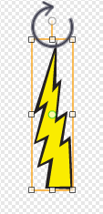

## Rayos

¡Vamos a darle la nave espacial de la capacidad de disparar rayos!

+ Añadir el objeto del 'rayo' de la biblioteca Scratch. Haga clic en el disfraz del objeto y girar el rayo hasta ponerlo del revés.

	

+ Cuando se inicia el juego, los rayos deben estar ocultos hasta que la nave espacial dispare sus cañones láser.

	```blocks
		al presionar bandera verde
		esconder
	```

+ Añadir el siguiente código ** a la nave espacial ** para crear un nuevo rayo cada vez que se pulsa la tecla de espacio.


	```blocks
		al presionar bandera verde
		por siempre
			si <¿tecla [espacio v] presionada?> entonces
				crear clon de [Rayo v]
			fin
		fin
	```

+ Siempre que se crea un nuevo clon, debe comenzar en el mismo lugar que la nave espacial, y luego subir por el escenario hasta que toque el borde. Agregar el siguiente código ** al objeto Relámpago **:

	```blocks
		al comenzar como clon
		ir a [Nave v]
		mostrar
		repetir hasta que <¿tocando [borde v] ?>
			cambiar y por (10)
		fin
		borrar este clon
	```

Nota: Movemos el nuevo clon de la nave espacial, mientras que todavía está oculto, antes de mostrarlo. Así se ve mejor.

+ Pon a prueba tu rayo, pulsando la tecla de espacio.

--- challenge ---

## Reto: Fijar el rayo 
¿Qué sucede si se mantiene la tecla de espacio pulsada? ¿Se puede utilizar un bloque `esperar`{:class="blockcontrol"} para fijarlo?

--- /challenge ---