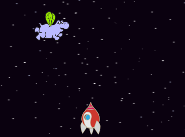
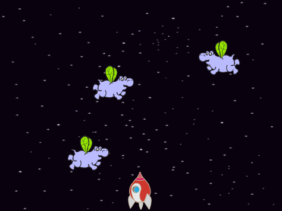
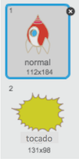
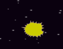

## Hipopótamos espaciales voladores

Vamos a añadir un montón de hipopótamos voladores que están tratando de destruir la nave espacial.

+ Crear un objeto nuevo desde la imagen 'hippo1' en la biblioteca Scratch

	

+ Establecer su estilo de rotación para girar a la derecha solamente, y agregar el siguiente código para ocultar el objeto cuando se inicia el juego:

	```blocks
		al presionar bandera verde
		esconder
	```

+ Crear una nueva variable llamada `velocidad`{:class="blockdata"} para el objeto hipopótamo solamente.

	

	Se sabrá si se ha hecho esto correctamente porque la variable tendrá el nombre del objeto al lado de él, como este:

	

+ El siguiente código creará un nuevo hipopótamo cada pocos segundos. ** La Etapa ** es un buen lugar para este código para vivir:

	```blocks
		al presionar bandera verde
		por siempre
			esperar (número al azar entre (2) y (4)) segundos
			crear clon de [Hippo1 v]
		fin
	```

+ Cuando se inicia cada clon hipopótamo, moverlo por el escenario (a una velocidad aleatoria) hasta que sea golpeado por el rayo. Añadir este código ** para el objeto hipopótamo ** :

	```blocks
		al comenzar como clon
		fijar [velocidad v] a (número al azar entre (2) y (4))
		ir a x: (número al azar entre (-220) y (220)) y: (150)
		mostrar
		repetir hasta que <¿tocando [lightning v] ?>
			mover (velocidad) pasos
			girar a la derecha (número al azar entre (-10) y (10)) grados
			rebotar si toca un borde
		fin
		borrar este clon
	```

+ Probar el código hipopótamo. Se debe ver un nuevo clon hipopótamo que aparece cada pocos segundos. Cada uno se mueve a su propio ritmo.

	

+ Pon a prueba tu cañón láser. Si te aciertas sobre un hipopótamo, ¿se desvanece?

+ Cuando un hipopótamo toca tu nave espacial, ¡tenemos que hacer que la nave espacial explote! Para ello, primero hay que asegurarse de que la nave espacial tiene 2 disfraces llamados 'normal' y 'tocado'.

	

	El disfraz 'tocado' de la nave espacial se puede hacer mediante la importación de la imagen 'Sol' de la biblioteca Scratch, y el uso de la herramienta 'Colorear una forma', para cambiar su color.

	

+ Añadir este código a la nave espacial para que se cambie de disfraz cada vez que choca con un hipopótamo volador:

	```blocks
		al presionar bandera verde
		por siempre
			cambiar disfraz a [normal v]
			esperar hasta que <¿tocando [Hippo1 v]?>
			cambiar disfraz a [tocado v]
			enviar [hit v]
			esperar (1) segundos
		fin
	```

+ ¿Te diste cuenta de que ha transmitido un mensaje de 'tocado' en el código anterior? Se puede utilizar este mensaje para hacer que todos los hipopótamos desaparecen cuando se alcance la nave espacial.

	Añadir este código al hipopótamo:

	```blocks
		al recibir [hit v]
		borrar este clon
	```

+ Probar este código al iniciar un nuevo juego y chocar con un hipopótamo.

	

--- challenge ---

## Reto: Vidas y Puntuación 
¿Se pueden añadir `vidas`{:class="blockdata"}, `puntuación`{:class="blockdata"} o incluso un `record`{:class="blockdata"} a tu juego? Utilizar como ayuda el proyecto "Catch the Dots".

--- /challenge ---
