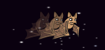
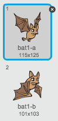
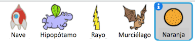

## ¡Murciélagos de la fruta!

Vamos a hacer un murciélago de la fruta que lanza naranjas a su nave espacial.

+ En primer lugar, hacer un nuevo objeto murciélago que se `moverá`{:class="blockmotion"} en la parte superior del escenario `por siempre`{:class="blockcontrol"}. Recuerda probar el código.

	

+ Si nos fijamos en los disfraces del murciélago, verás que ya cuenta con 2:

	

	Utilizar el bloque `siguiente disfraz`{:class="blocklooks"} para hacer que el murciélago mueva las alas mientras se mueve.

+ Crear un nuevo objeto 'Naranja' de la biblioteca de Scratch

	


+ Añadir código al murciélago, de manera que se crea un nuevo clon de naranja cada pocos segundos.

	```blocks
		al presionar bandera verde
		por siempre
			esperar (número al azar entre (5) y (10)) segundos
			crear clon de [Naranja v]
		fin
	```

+ Haga clic en el objeto naranja. Añadir este código para que cada clon de naranja caiga por el escenario desde el murciélago hacia la nave espacial:

	```blocks
		al presionar bandera verde
		esconder

		al comenzar como clon
		ir a [Bat1 v]
		mostrar
		repetir hasta que <¿tocando [borde v]?>
			cambiar y por (-4)
		fin
		borrar este clon

		al recibir [tocado v]
		borrar este clon
	```

+ En el objeto nave espacial, modificar el código para que se destruya si se toca un hipopótamo o un naranja:

	```blocks
		esperar hasta que <<¿tocando [Hippo1 v]?> o <¿tocando [Naranja v]?>>
	```

+ Probar el juego. ¿Qué sucede si es golpeado por una caída de naranja?
