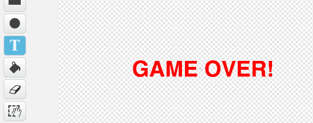

## Fin del Juego

Vamos a añadir un mensaje "Fin del Juego" al final del juego.

+ Si no lo has hecho, crea una nueva variable llamada `vidas`{:class="blockdata"}. La nave espacial debe comenzar con 3 vidas y perder una vida cada vez que choca con un enemigo. El juego debe parar también cuando te quedas sin vidas. Si necesitas ayuda, puedes utilizar el proyecto "Catch the Dots".

+ Dibuja un nuevo objeto llamado 'Fin del Juego', utilizando la herramienta de texto.

	

+ En el escenario, mostrar un mensaje `Fin del juego`{:class="blockevents"} justo antes de que el juego termine.

	```blocks
		enviar [Fin del juego v] y esperar
	```

+ Añadir este código al objeto 'Fin del juego', para que el mensaje se muestre al final del juego:

	```blocks
		al presionar bandera verde
		esconder

		al recibir [Fin del juego v]
		mostrar
	```

	Como has usado un bloque `enviar [fin del juego] y esperar`{:class="blockevents"}, se esperará a que el objeto de 'Fin del juego' se muestre antes de terminar el juego.

+ Probar el juego. ¿Cuántos puntos se pueden anotar? ¿Puedes pensar en maneras de mejorar su juego si es demasiado fácil o demasiado difícil?
