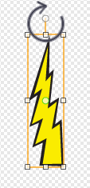

## Coup de tonnerre

Donnons au vaisseau spatial la capacité de renvoyer des coups de tonnerre!

+ Ajoutez le lutin 'Lightning' en utilisant la bibliothèque de Scratch. Cliquez sur le lutin et tournez la foudre à l'envers.

	

+ Quand le jeu est commencé, la foudre devrait être cachée jusqu'à ce que le vaisseau spatial ne tire ses coups de canon laser.

	```blocks
		quand le drapeau vert pressé
		cacher
	```

+ Ajoutez le code suivant au vaisseau spatial pour créer un nouveau coup de foudre quand la barre d'espace est appuyée.


	```blocks
		quand le drapeau vert pressé
		répéter indéfiniment
			si <touche [espace v] pressée?> alors
      			créer un clone de [Lightning v]
			fin
		fin
	```

+ Quand un nouveau clone est créé, il devrait commencer au même endroit que le vaisseau spatial et avancer ensuite sur l'étape jusqu'à ce qu'il touche le bord. Ajoutez le code suivant au lutin de foudre :

	```blocks
		quand je commence comme un clone
		aller à [Spaceship v]
		montrer
		répéter jusqu’à <[bord v] touché?>
   			ajouter (10) à y
		fin
		supprimer ce clone
	```

À noter : Nous déplaçons le nouveau clone vers le vaisseau spatial lorsqu'il est toujours caché, avant de le montrer ainsi. Cela a l'air plus adéquat.

+ Testez votre foudre, en tapant la touche spatiale.

--- challenge ---

## Défi : Réparation de la foudre 
Qu'arrive-t-il si vous gardez la touche spatiale maintenue ? Pouvez vous utiliser le bloc `attendre`{:class="blockcontrol"} pour réparer cela ?

--- /challenge ---