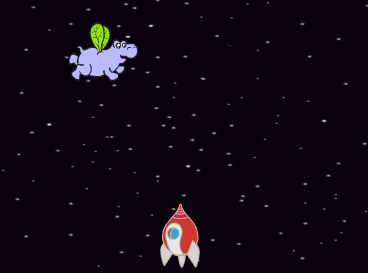
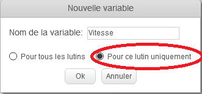
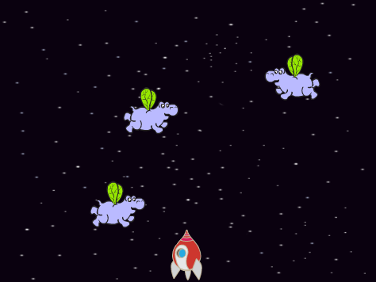
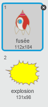
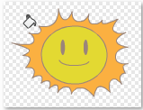

## Hippopotames spatiaux

Ajoutons des hippopotames volants qui essaient de détruire votre vaisseau spatial.

+ Créez un nouveau lutin 'Hippo1' dans la bibliothèque de Scratch.

	

+ Ajuster sa rotation pour qu'elle soit de gauche à droite seulement et puis ajouter le code suivant pour cacher le lutin lorsque le jeu commencera :

	```blocks
		quand le drapeau vert pressé
		cacher
	```

+ Créez une nouvelle variable appelée `Vitesse`{:class="blockdata"}, c'est pour le lutin d'hippopotame seulement.

	

	Vous saurez immédiatement si vous l'avez fait correctement car la variable aura le nom du lutin à côté de son nom, comme ceci:

	

+ Le code suivant créera un nouvel hippopotame a quelques secondes d'intervalle. La scène est un bon endroit pour ce code :

	```blocks
		quand le drapeau vert pressé
		répéter indéfiniment
   			attendre (nombre aléatoire entre (2) et (4)) secondes
   			créer un clone de [Hippo1 v]
		fin
	```

+ Lorsque chaque clone d'hippopotame démarrera, déplacez-le autour de la scène (à une vitesse aléatoire) jusqu'à ce qu'il soit frappé par la foudre. Ajoutez ce code au clone d'hippopotame :

	```blocks
		quand je commence comme un clone
		mettre [speed v] à (nombre aléatoire entre (2) et (4))
		aller à x:(nombre aléatoire entre (-220) et (220)) y:(150)
		montrer
		répéter jusqu’à <[lightning v] touché?>
   			avancer de (speed)
   			tourner droite de (nombre aléatoire entre (-10) et (10)) degrés
   			rebondir si le bord est atteint
		fin
		supprimer ce clone
	```

+ Testez votre code d'hippopotame. Vous devriez voir qu'un nouveau clone d'hippopotame apparaît à quelques secondes d'intervalle, chacun de déplaçant à sa propre vitesse.

	

+ Testez votre canon laser. Si vous frappez un hippopotame, disparaît-t-il ?

+ Lorsqu'un hippopotame touche votre vaisseau spatial, nous devons faire éclater le vaisseau spatial! Pour faire cela, vous devez vous assurer que votre vaisseau spatial a 2 costumes appelés 'normal' et 'hit'.

	

	Le costume du vaisseau spatial 'hit' peut être fait en important l'image 'soleil' de la bibliothèque de Scratch et en utilisant l'outil 'colorier une forme' afin de changer sa couleur.

	

+ Ajoutez ce code à votre vaisseau spatial pour qu'il change de costume a chaque fois qu'il entre en collision avec un hippopotame volant :

	```blocks
		quand le drapeau vert pressé
		répéter indéfiniment
   			basculer sur le costume [normal v]
   			attendre jusqu’à <[Hippo1 v] touché?>
   			basculer sur le costume [hit v]
   			envoyer à tous [hit v]
   			attendre (1) secondes
		fin
	```

+ Avez-vous remarqué que vous avez l'émission du message 'hit' dans le code ci-dessus ? Vous pouvez utiliser ce message pour faire disparaître tous les hippopotames lorsque le vaisseau spatial est touché.

	Ajoutez ce code à votre hippopotame :

	```blocks
		quand je reçois [hit v]
		supprimer ce clone
	```

+ Testez ce code en commençant un nouveau jeu et en entrant en collision avec un hippopotame.

	

--- challenge ---

## Défi : Vies et Score 
Pouvez-vous ajouter `vies`{:class="blockdata"}, `score`{:class="blockdata"} ou même un `meilleur score`{:class="blockdata"} à votre jeu ? Le projet 'Catch the Dots' permettra de vous aider.

--- /challenge ---
