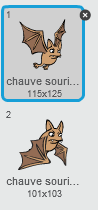
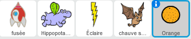

## Une chauve-souris !

Créons une chauve-souris qui jette des oranges à votre vaisseau spatial.

+ Premièrement, créer un nouveau lutin de chauve-souris qui `se déplacera`{:class="blockmotion"} à travers le sommet de la scène `indéfiniment`{:class="blockcontrol"}. Rappelez-vous de tester votre code.

	

+ Si vous regardez les costumes de la chauve-souris, vous verrez qu'il en a déjà 2 :

	

	Utilisez le bloc `costume suivant`{:class="blocklooks"} pour faire bouger les ailes de la chauve-souris lorsqu'elle se déplace.

+ Créez un nouveau lutin 'Orange' de la bibliothèque de Scratch

	


+ Ajoutez le code à votre chauve-souris, pour qu'il créé une nouvelle orange à quelques secondes d'intervalle.

	```blocks
		quand le drapeau vert pressé
		répéter indéfiniment
   			attendre (nombre aléatoire entre (5) et (10)) secondes
   			créer un clone de [Orange v]
		fin
	```

+ Cliquez sur votre lutin orange et ajoutez ce code pour faire tomber chaque clone 'orange' en bas de la scène, de la chauve-souris vers le vaisseau spatial :

	```blocks
		quand le drapeau vert pressé
		cacher

		quand je commence comme un clone
		aller à [Bat1 v]
		montrer
		répéter jusqu’à <[bord v] touché?>
   			ajouter (-4) à y
		fin
		supprimer ce clone

		quand je reçois [hit v]
		supprimer ce clone
	```

+ Dans votre lutin de vaisseau spatial, vous devrez modifier votre code pour que vous soyez frappés si vous touchez un hippopotame ou une orange :

	```blocks
		attendre jusqu’à <<[Hippo1 v] touché?> ou <[Orange v] touché?>>
	```

+ Testez votre jeu. Qu'arrive-t-il si vous êtes frappés par une orange?
