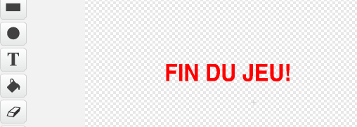

## Fin du jeu

Ajoutons un message 'Game Over' à la fin du jeu.

+ Créez une nouvelle variable appelée `vies`{:class="blockdata"} si ce n'est pas déjà fait. Votre vaisseau spatial devrait commencer avec 3 vies et devrait perdre une vie lorsqu'il entre en collision avec un ennemi. Votre jeu devrait aussi s'arrêter lorsque vous perdez toutes vos vies. Si vous avez besoin d'aide, vous pouvez utiliser le projet 'Catch the dots' pour vous aider.

+ Dessinez un nouveau lutin appelé 'Fin du jeu', en utilisant l'outil de texte.

	

+ Sur votre étape, émettez le message `game over`{:class="blockevents"} juste avant la fin de jeu.

	```blocks
		envoyer à tous [game over v] et attendre
	```

+ Ajoutez ce code à votre lutin 'Game Over' pour que le message puisse apparaître à la fin du jeu :

	```blocks
		quand le drapeau vert pressé
		cacher

		quand je reçois [game over v]
		montrer
	```

	A  cause du bloc `envoyer à tous [le jeu sur] et attendre`{:class="blockevents"} que vous avez utilisé sur votre scène, il attendra que le lutin 'Game Over' soit montré avant de finir la partie.

+ Testez votre jeu. Combien de points pouvez-vous marquer ? Pensez aux façons d'améliorer votre jeu si c'est trop facile ou trop difficile ?
