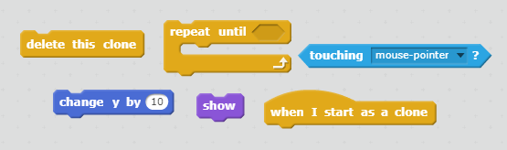

## लाइटनिंग बोल्ट्स

चलिए स्पेसशिप को लाइटनिंग बोल्ट फायर करने का सामर्थ्य दें!

+ Scratch लाइब्रेरी से `बिजली` स्प्राइट शामिल करें।  

+ जब गेम शुरू होता है, तो `बिजली` स्प्राइट तब तक छिपी होनी चाहिए जब तक स्पेसशिप अपनी लेज़र तोपों से फ़ायर नहीं करती, इसलिए `बिजली` स्प्राइट में यह कोड शामिल करें:

```blocks
जब ⚑ क्लिक किया गया हो
छुपाएँ
```

फिलहाल आपके पास फ़ायर करने के लिए स्पेसशिप में विशालकाय लाइटनिंग बोल्ट है!

+ उन ब्लॉक के नीचे कुछ कोड शामिल करें जिन्हें आपने `बिजली` स्प्राइट को छोटा और उल्टा करने के लिए शामिल किया है। फिर यह ऐसा दिखाई देगा कि यह स्पेसशिप से पहले सबसे पहले नुकीली वस्तु से फ़ायर करता है।

```blocks
अाकार (25) % पर सेट करे
(-90 v) की दिशा में देखे
```

+ स्टेज के नीचे स्प्राइट्स पैनल में `अंतरिक्ष यान` स्प्राइट पर क्लिक करके, इस पर स्विच करें।

+ **स्थान** कुंजी दबाए जाने पर, `अंतरिक्ष यान` स्प्राइट द्वारा नया लाइटनिंग बोल्ट बनाने के लिए कुछ नया कोड शामिल करेंएं।

--- hints ---
--- hint ---
आपके लिए कुछ सूडोकोड इस प्रकार है:

जब हरे फ्लैग पर क्लिक किया जाता है
हमेशा जांच जारी रखें
**स्थान** कुंजी दबाए जाने की स्थिति में, `बिजली` स्प्राइट का क्लोन बनाएं
--- /hint ---
--- hint ---
ये वे ब्लॉक हैं, जिनकी आपको आवश्यकता होगी:


--- /hint ---
--- hint ---
ये वे कोड हैं, जिनकी आपको आवश्यकता होगी:

```blocks
जब ⚑ क्लिक किया गया हो
हमेशा के लिए
end
	अगर <[स्पेस v] बटन दबाया है?> हो तो
end
		[बिजली v] का क्लोन बनाए
	end
end
```
--- /hint ---
--- /hints ---

+ पुनः `बिजली` स्प्राइट पर स्विच करें।

+ जब भी लाइटनिंग बोल्ट बनाया जाता है, तो यह दिखाई देना चाहिए और इसे तब तक ऊपर की ओर बढ़ते रहना चाहिए जब तक यह स्क्रीन के शीर्ष तक न पहुंच जाए। फिर इसे गायब हो जाना चाहिए।

--- hints ---
--- hint ---

जब नया `बिजली` स्प्राइट क्लोन दिखाई देता है:
- इसे प्रदर्शित करें
- इसे तब तक `10` से उपर ले जाना जारी रखें, जब तक यह स्क्रीन के किनारे को न छू ले
- फिर क्लोन को हटा दें
--- /hint ---
--- hint ---
ये वे ब्लॉक हैं, जिनकी आपको आवश्यकता होगी:


--- /hint ---
--- hint ---
यह वह कोड है, जिसकी आपको `बिजली` स्प्राइट शामिल करने के लिए आवश्यकता होगी:

```blocks
	मेरे एक क्लोन के रूप में शुरू होने पर
    दिखाएं
	<[किनारा v] को छू रहा है?> तक दोहराते रहे
end
		(10) से y बदले
	end
	इस क्लोन को डिलिट करें
```
--- /hint ---
--- /hints ---


+ हरे फ्लैग पर क्लिक करके और फिर **स्थान** बार दबाकर अपनी `बिजली` स्प्राइट का परीक्षण करें। जब आप **स्थान** दबाते हैं, तो क्या लाइटनिंग दिखाई देती है और स्क्रीन के ऊपर की ओर जाती है? आपको कौन सी समस्या दिखाई देती है?

--- collapse ---
---
title: उत्तर
---
ओह - इस समय लाइटनिंग हमेशा उसी स्थान से फ़ायर करती है, चाहे स्पेसशिप कहीं भी हो!

`दिखाएं`{:class="blocklooks"} ब्लॉक से पहले इस ब्लॉक को शामिल करें, ताकि `बिजली` स्प्राइट का क्लोन दिखाई देने से पहले `अंतरिक्ष यान` स्प्राइट की स्थिति में स्थानांतरित हो। इससे यह ऐसा दिखेगा जैसे लाइटनिंग बोल्ट स्पेसशिप से फ़ायर कर रहा है।

```blocks
[अंतरिक्ष यान v] पर जाएँ
```

--- /collapse ---

+ यह देखने के लिए **स्थान** कुंजी दबाएँ कि क्या आपका लाइटनिंग बोल्ट सही ढंग से फायर करता है।

--- challenge ---
### चुनौती: लाइटनिंग ठीक करना
यदि आप **स्थान** कुंजी को होल्ड करें, तो क्या होगा? क्या आप इसे ठीक करने के लिए `ठहरें`{:class="blockcontrol"} ब्लॉक का उपयोग कर सकते हैं?

--- /challenge ---
