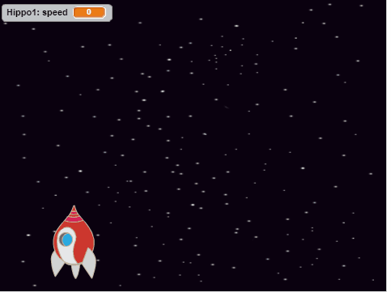

## फ्लाइंग स्पेस-हिप्पोस

चलिए बहुत से हिप्पो शामिल करें, जो आपकी स्पेसशिप को नष्ट करने की कोशिश करेंगे।

+ Scratch लाइब्रेरी में `Hippo1` (हिप्पो1) छवि के साथ नई स्प्राइट बनाएं। `Hippo` स्प्राइट का आकार `अंतरिक्ष यान` स्प्राइट के समान बनाने के लिए, **श्रिंक करें** टूल का उपयोग करें।


+ `Hippo` स्प्राइट के चक्कर को केवल बाईं से दाईं ओर सेट करें।

[[[generic-scratch-sprite-rotation-style]]]

+ गेम शुरू होने पर `Hippo` स्प्राइट छिपाने के लिए कुछ कोड शामिल करें।

--- hints ---
--- hint ---
यह कोड वैसा ही है, जो आपने गेम आरंभ होने पर `बिजली` स्प्राइट छिपाने के लिए किया था।
--- /hint ---
--- hint ---
ये वे कोड हैं, जिनकी आपको आवश्यकता होगी:

```blocks
जब ⚑ क्लिक किया गया हो
छुपाएँ
```
--- /hint ---
--- /hints ---

+ निचले पैनल में स्टेज पर क्लिक करके इस पर स्विच करें।

+ हर कुछ सेकंड के बाद नया हिप्पो बनाने के लिए, स्टेज में कुछ कोड शामिल करें।

--- hints ---
--- hint ---
जब हरे फ्लैग पर क्लिक किया जाता है
बार-बार...
- 2 और 4 सेकंड तक प्रतीक्षा करें
- हिप्पो स्प्राइट का क्लोन बनाएँ

--- /hint ---
--- hint ---
ये वे ब्लॉक हैं, जिनकी आपको आवश्यकता होगी:


--- /hint ---
--- hint ---
ये वे कोड हैं, जिनकी आपको आवश्यकता होगी:
```blocks
जब ⚑ क्लिक किया गया हो
हमेशा के लिए
end
	((2) से (4) तक क्रमरहित चुनने) सेकेंड तक ठहरे
	[Hippo1 v] का क्लोन बनाए
end
```
--- /hint ---
--- /hints ---

+ वापस `Hippo` स्प्राइट पर स्विच करें।

प्रत्येक नया हिप्पो बेतरतीब x-स्थिति पर दिखाई देना चाहिए, और प्रत्येक की बेतरतीब गति होनी चाहिए।

+ `गति`{:class="blockdata"} नामक नया वेरिएबल बनाएँ, जो केवल `Hippo` स्प्राइट के लिए हो।

[[[generic-scratch-add-variable]]]

आपको तब यह पता चलेगा कि आपने इसे ठीक ढंग से किया है, जब आप देख पाएंगे कि इस तरह स्प्राइट नाम वेरिएबल के साथ होता है, जैसे:


+ जब प्रत्येक हिप्पो का क्लोन आरंभ होता है, तो इसे स्क्रीन पर दिखाने से पहले बेतरतीब गति और आरंभिक स्थान चुनें।

```blocks
मेरे एक क्लोन के रूप में शुरू होने पर
[गति v] पर ((2) से (4) तक क्रमरहित चुनने) सेट करे
x:((-220) से (220) तक क्रमरहित चुनने) y:(150) पर जाएँ
दिखाएं
```

+ हरे फ्लैग पर क्लिक करके अपने कोड का परीक्षण करें। क्या हर कुछ सेकंड में नया हिप्पो दिखाई देता है? फ़िलहाल आपके हिप्पो गति नहीं करेंगे।

+ हिप्पो तब तक बेतरतीब रूप से गति करेगा, जब तक यह लाइटनिंग बोल्ट से न टकरा जाए। ऐसा करने के लिए, अपने शामिल किए गए ब्लॉक के नीचे, यह कोड शामिल करें:

```blocks
<[बिजली v] को छू रहा है?> तक दोहराते रहे
end
	(गति) कदम चले
	↻ ((-10) से (10) तक क्रमरहित चुनने) डिग्री से घूम जाए
	अगर किनारे पर है तो उछाले
end
इस क्लोन को डिलिट करें
```

+ अपने हिप्पो कोड का परीक्षण करें। आपको हर कुछ सेकंड में नया हिप्पो क्लोन दिखाई देना चाहिए, और प्रत्येक हिप्पो की अपनी स्वयं की गति होगी।

	

+ अपनी लेज़र तोप का परीक्षण करें। यदि आप हिप्पो से टकराते हैं, तो क्या यह गायब हो जाता है?
