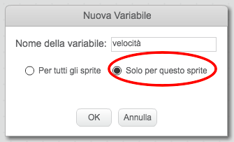
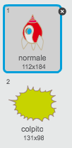

## Ippopotami Spaziali Volanti

Aggiungiamo un mucchio di ippopotami volanti che cercano di distruggere la tua astronave.

+ Crea un nuovo sprite dall'immagine 'Ippopotamo1' nella libreria Scratch.

	

+ Imposta il suo stile di rotazione in modo che sia solo destra-sinistra, e aggiungi il seguente codice per nascondere lo sprite quando la partita inizia:

	```blocks
		quando si clicca sulla bandiera verde
		nascondi
	```

+ Crea una nuova variabile chiamata `velocità`{:class="blockdata"}, che è solo per lo sprite dell'ippopotamo.

	

	Saprai se lo hai fatto correttamente perché la variabile avrà accanto il nome dello sprite, in questo modo:

	

+ Il seguente codice creerà un nuovo ippopotamo ogni pochi secondi. **Il Quadro** è un buon posto per far vivere questo codice:

	```blocks
		quando si clicca sulla bandiera verde
		per sempre
  			attendi (numero a caso tra (2) e (4)) secondi
  			crea clone di [Ippopotamo1 v]
		end
	```

+ Quando inizia ogni clone di ippopotamo, fallo muovere attorno al quadro (a una velocità casuale) finché non verrà colpito dal fulmine. Aggiungi questo codice allo sprite **ippopotamo**:

	```blocks
		quando vengo clonato
		porta [velocità  v] a (numero a caso tra (2) e (4))
		vai a x: (numero a caso tra (-220) e (220)) y: (150)
		mostra
		ripeti fino a quando <sta toccando [fulmine v]>
  			fai (velocità) passi
  			ruota in senso orario di (numero a caso tra (-10) e (10)) gradi
  			rimbalza quando tocchi il bordo
		end
		elimina questo clone
	```

+ Prova il tuo codice ippopotamo. Vedrai apparire un nuovo clone ippopotamo ogni pochi secondi, e ognuno si muoverà alla sua velocità.

	

+ Prova il tuo cannone laser. Se colpisci un ippopotamo, svanisce?

+ Quando un ippopotamo tocca la tua astronave, dobbiamo farla esplodere! Per fare ciò, assicurati che la tua astronave abbia 2 costumi chiamati 'normale' e 'colpito'.

	

	Il costume 'colpito' dell'astronave può essere creato importando l'immagine 'Sole' dalla libreria Scratch, e usando lo strumento 'Colora una forma' per cambiarne il colore.

	

+ Aggiungi questo codice alla tua astronave in modo che cambi costume ogni volta che si scontra con un ippopotamo volante:

	```blocks
		quando si clicca sulla bandiera verde
		per sempre
  			passa al costume [normale v]
  			attendi fino a quando <sta toccando [Ippopotamo1 v]>
  			passa al costume [colpito v]
  			invia a tutti [colpito v]
  			attendi (1) secondi
		end
	```

+ Hai notato di aver trasmesso un messaggio 'colpito' al codice qui sopra? Puoi usare questo messaggio per fare scomparire tutti gli ippopotami quando l'astronave viene colpita.

	Aggiungi questo codice al tuo ippopotamo:

	```blocks
		quando ricevo [colpito v]
		elimina questo clone
	```

+ Prova questo codice iniziando una nuova partita e scontrandoti con un ippopotamo.

	

--- challenge ---

## Sfida: Vite e Punteggio
Puoi aggiungere al tuo gioco un blocco `vite`{:class="blockdata"}, `punteggio`{:class="blockdata"} o perfino `punteggio alto`{:class="blockdata"}? Per aiutarti, puoi usare il progetto 'Acchiappa i Puntini'.

--- /challenge ---