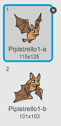
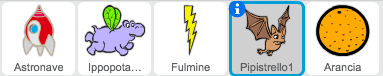

## Pipistrelli della Frutta!

Creiamo ora un pipistrello della frutta che getta arance alla tua astronave.

+ Per prima cosa, creiamo un nuovo sprite di pipistrello che si `muoverà`{:class="blockmotion"} attraverso la parte superiore del quadro `per sempre`{:class="blockcontrol"}. Ricordati di provare il tuo codice.

	

+ Se guardi gli costumi del pipistrello, vedrai che ne ha già 2:

	

	Usa il blocco `passa al costume seguente`{:class="blocklooks"} per far sbattere le ali al pipistrello mentre si muove.

+ Crea un nuovo sprite 'Arancia' dalla libreria Scratch.

	


+ Aggiungi il codice al tuo pipistrello, in modo che crei un nuovo clone di arancia ogni alcuni secondi.

	```blocks
		quando si clicca sulla bandiera verde
		per sempre
  			attendi (numero a caso tra (5) e (10)) secondi
  			crea clone di [Arancia v]
		end
	```

+ Clicca sul tuo sprite di arancia e aggiungi questo codice per far sì che ogni clone di arancia si apra dal pipistrello verso l'astronave:

	```blocks
		quando si clicca sulla bandiera verde
		nascondi

		quando vengo clonato
		raggiungi [Pipistrello1 v]
		mostra
		ripeti fino a quando <sta toccando [bordo v]>
  			cambia y di (-4)
		end
		elimina questo clone

		quando ricevo [colpito v]
		elimina questo clone
	```

+ Nello sprite della tua astronave, dovrai modificare il tuo codice così che tu venga colpito se tocchi un ippopotamo o un'arancia:

	```blocks
		attendi fino a quando <<sta toccando [Ippopotamo1 v]> o <sta toccando [Arancia v]>>
	```

+ Prova il tuo gioco. Che succede se vieni colpito da un'arancia in caduta?
