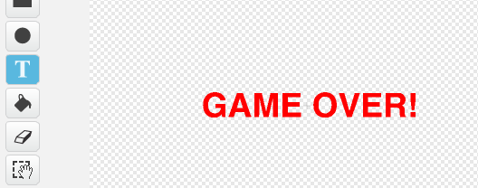

## Game over

Aggiungiamo un messaggio 'game over' alla fine del gioco.

+ Se non l'hai ancora fatto, crea una nuova variabile, chiamata `vite`{:class="blockdata"}. La tua astronave dovrebbe cominciare da 3 vite e perdere uan vita ogni volta che si scontra con un nemico. Il tuo gioco dovrebbe anche interrompersi quando termini le vite. Per aiutarti, puoi usare il progetto 'Acchiappa i Puntini'.

+ Disegna un nuovo sprite chiamato 'Game Over', usando l'editore.

	

+ Sul tuo quadro, trasmetti un messaggio `game over`{:class="blockevents"} appena prima che la partita finisca.

	```blocks
		invia a tutti [game over v] e attendi
	```

+ Aggiungi questo codice al tuo sprite 'Game Over', così che il messaggio venga visualizzato alla fine del gioco:

	```blocks
		quando si clicca sulla bandiera verde
		nascondi

		quando ricevo [game over v]
		mostra
	```

	Siccome hai usato sul quadro un blocco `invia a tutti [game over v] e attendi`{:class="blockevents"}, aspetterà che lo sprite 'Game Over' sia visualizzato prima di terminare la partita.

+ Prova il tuo gioco. Quanti punti puoi accumulare? Hai qualche idea per migliorare il tuo gioco se è troppo facile o troppo difficile?
