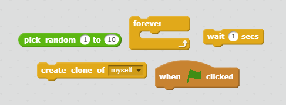
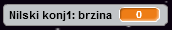

## Leteći svemirski nilski konji

Dodajmo mnogo letećih nilskih konja koji će pokušati da unište tvoj svemirski brod.

+ Kreiraj novi lik koristeći sliku `Hippo1` iz Scratch biblioteke. Koristi alat **shrink** (smanji) da napraviš da lik `Nilskog konja` bude veličine slične veličini lika `Svemirskog broda`.


+ Postavi stil rotacije (rotation style) lika `Nilskog konja` da bude samo lijevo-desno (left-right).

[[[generic-scratch-sprite-rotation-style]]]

+ Dodaj kôd da lik `Nilskog konja` bude sakriven kada igra započne.

--- hints --- --- hint --- Kôd za to je potpuno isti kao kôd koji smo koristili za sakrivanje lika `Munje` kada igra započne. --- /hint --- --- hint --- Ovdje je kôd koji će ti biti potreban:

```blocks
when green flag clicked
hide
```

--- /hint --- --- /hints ---

+ Pređi na Pozornicu (Stage) tako što ćeš kliknuti na nju u donjem panelu.

+ Dodaj Pozornici kôd da kreira novog nilskog konja svakih nekoliko sekundi.

--- hints --- --- hint --- Kada je kliknuto na zelenu zastavicu (when the green flag is clicked): Ponavljano (repeatedly)...

+ Čekaj (wait) od 2 do 4 sekunde
+ Kreiraj klona (create a clon) lika nilskog konja

--- /hint --- --- hint --- Ovdje su blokovi koji će ti biti potrebni: 

--- /hint --- --- hint --- Ovdje je kôd koji će ti biti potreban:

```blocks
when flag clicked
forever
    wait (pick random (2) to (4)) secs
    create clone of [Nilski konj v]
end
```

--- /hint --- --- /hints ---

+ Vrati se na lik `Nilskog konja`.

Svaki novi nilski konj treba da se pojavi na slučajnoj x-poziciji i svaki treba da ima slučajnu brzinu.

+ Napravi novu promjenljivu (variable) pod nazivom `brzina`{:class="blockdata"} samo za lik `Nilskog konja`.

[[[generic-scratch-add-variable]]]

Znaćeš da si ovo pravilno uradio/uradila kada vidiš da pored naziva promjenljive stoji naziv lika, kao ovdje:



+ Kada klon nilskog konja krene, izaberi slučajnu brzinu i slučajno početno mjesto prije njegovog prikazivanja na ekranu.

```blocks
when I start as a clone
set [brzina v] to (pick random (2) to (4))
go to x: (pick random (-220) to (220)) y: (150)
show
```

+ Isprobaj svoj kôd tako što ćeš kliknuti na zelenu zastavicu. Da li se novi nilski konj pojavljuje svakih nekoliko sekundi? Trenutno se tvoji nilski konji ne kreću.

+ Nilski konj bi trebalo da se kreće nasumično dok ga ne pogodi munja. Da to napraviš, dodaj ovaj kôd ispod prethodno dodatih blokova:

```blocks
repeat until <touching [lightning v] ?>
    move (brzina) steps
    turn right (pick random (-10) to (10)) degrees
    if on edge, bounce
end
delete this clone
```

+ Isprobaj svoj kôd nilskog konja. Trebalo bi da vidiš da se novi klon nilskog konja pojavljuje svakih nekoliko sekundi i da se svaki kreće sopstvenom brzinom.
    
    

+ Ispobaj svoj laserski top. Da li nilski konj nestaje kada ga pogodiš?