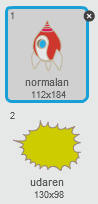

## Eksplozija svemirskog broda

Kada nilski konj dodirne tvoj svemirski brod, brod treba da eksplodira!

+ Izaberi lik `Svemirskog broda` i preimenuj kostim (costume) u 'normalan'.

+ Nacrtaj drugi kostim eksplozije svemirskog broda i nazovi ga 'udaren'.



Ili, ako ne želiš da nacrtaš eksploziju, možeš da izabereš kostim 'Sun' (Sunce) iz Scratch biblioteke, a zatim da upotrijebiš alat **Color a shape** (Oboji oblik) da promijeniš njegovu boju i da ukloniš lice.


+ Dodaj kôd liku `Svemirskog broda` tako da krene prikazujući kostim svemirskog broda, a kada dodirne letećeg nilskog konja, da promijeni kostim u 'udaren':

```blocks
when flag clicked
switch costume to [normalan v]
wait until <touching [Hippo1 v]>?
switch costume to [udaren v]
```

+ Isprobaj svoj kôd tako što ćeš odigrati igru i sudariti se sa nilskim konjem. Da li svemirski brod mijenja kostim u 'udaren'?