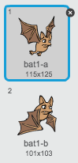

## Slijepi miš sa voćem

Da bi igra bila malo teža, napravimo slijepog miša koji baca pomorandže na svemirski brod.

+ Dodaj lik `Slijepog miša` i postavi njegov stil rotacije samo na **lijevo-desno**.

+ Napravi da se lik `Slijepog miša` `neprestano`{:class="blockcontrol"} `kreće`{:class="blockmotion"} sa jedne na drugu stranu u gornjem dijelu Pozornice. Ne zaboravi da isprobaš svoj kôd.


--- hints --- --- hint --- Kada je kliknuto na zastavicu (when the flag is clicked), lik `Slijepog miša` treba neprestano (forever)

+ da ide (move) 10 koraka
+ kada stigne do ivice (edge), da se okrene (bounce) --- /hint --- --- hint --- Ovdje je kôd koji će ti biti potreban:

```blocks
when flag clicked
forever
    move (10) steps
    if on edge, bounce
end
```

--- /hint --- --- /hints ---

Ako pogledaš kostime slijepog miša, vidjećeš da već ima dva različita kostima:



+ Upotrijebi blok `next costume`{:class="blocklooks"} (sljedeći kostim) da napraviš da slijepi miš maše krilima dok se kreće.

--- hints --- --- hint --- Nakon što krene, slijepi miš treba da pokaže `sljedeći kostim`{:class="blocklooks"} (next costume), a zatim da `čeka`{:class="blockcontrol"} (wait) kratko vrijeme. --- /hint --- --- hint --- Ovdje je kôd koji će ti biti potreban:

```blocks
next costume
wait (0.3) secs
```

--- /hint --- --- hint --- Ovdje je cijeli kôd, sa dodatim novim kôdom:

```blocks
when flag clicked
forever
    move (10) steps
    if on edge, bounce
    next costume
    wait (0.3) secs
end
```

--- /hint --- --- /hints ---

Napravimo sada da slijepi miš baca pomorandže.

+ Dodaj novi lik `Orange` (Pomorandža) iz Scratch biblioteke.


+ Dodaj kôd svom slijepom mišu tako da, kada je kliknuto na zastavicu, čeka slučajan period vremena od 5 do 10 sekundi, a zatim napravi klona lika `Pomorandže`.

--- hints --- --- hint --- Pogledaj kôd koji si napisao/napisala za kreiranje lika `Munje`. Kôd koji ti je sada potreban je veoma sličan, osim što pomorandža, umjesto da se pojavi kada pritisneš taster za **razmak**, treba da se pojavi nakon što `sačekaš`{:class="blockcontrol"} `5-10`{:class="blockoperators"} sekundi. --- /hint --- --- hint --- `Kada je kliknuto na zastavicu`{:class="blockcontrol"} (when the flag is clicked), lik `Slijepog miša` treba `neprestano`{:class="blockcontrol"} (forever) da

+ `čeka`{:class="blockcontrol"} (wait) `slučajan`{:class="blockoperators"} (random) period vremena od `5-10`{:class="blockoperators"} sekundi
+ `kreira klona`{:class="blockcontrol"} (create a clone) lika `Pomorandže` --- /hint --- --- hint --- Ovdje je kôd koji će ti biti potreban:

```blocks
when flag clicked
forever
    wait (pick random (5) to (10)) secs
    create clone of [Pomorandža v]
end
```

--- /hint --- --- /hints ---

+ Klikni na lik `Pomorandže` i dodaj kôd da napraviš da svaki klon lika `Pomorandže` pada od lika `Slijepog miša` prema donjem dijelu Pozornice.

--- hints --- --- hint --- Ovaj kôd, koji želiš da dodaš, skoro je isti kao kôd unutar lika `Munje`, osim što lik `Pomorandže` treba da `ide na`{:class="blockmotion"} (go to) poziciju lika `Slijepog miša`, i treba da koristi blok `change y by`{:class="blockcontrol"} (promijeni y za) kako bi se kretao nadolje umjesto nagore. --- /hint --- --- hint --- Ovdje je kôd koji će ti biti potreban:

```blocks
    when flag clicked
    hide

    when I start as a clone
    go to [Slijepi miš1 v]
    show
    repeat until <touching [edge v]?
        change y by (-4)
    end
    delete this clone

```

--- /hint --- --- /hints ---

+ Dodaj još kôda liku `Pomorandže`, tako da nestane kada je `Svemirski brod` udaren, dajući igraču mogućnost da se vrati na početnu poziciju:

```blocks
    when I receive [udaren v]
    delete this clone
```

+ Takođe, treba da izmijeniš kôd u liku `Svemirskog broda` tako da promijeni kostim u 'udaren' kada dodirne lik `Nilskog konja` ili lik `Pomorandže`:

```blocks
    wait until < <touching [Hippo1 v]?> or <touching [Orange v]?>>
```

+ Isprobaj svoju igru. Šta se dešava kada te udari pomorandža koja pada?