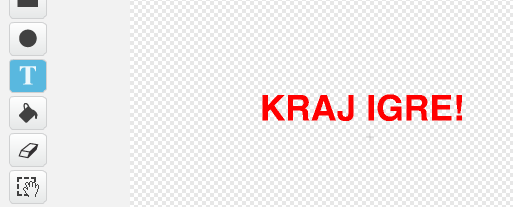

## Kraj igre

Dodajmo poruku 'kraj igre' na kraju igre.

+ Ako to nisi već uradio/uradila, napravi novu promjenljivu pod nazivom `životi`{:class="blockdata"}.

Tvoj svemirski brod treba da počne sa tri života i da izgubi život svaki put kada dodirne nilskog konja ili pomorandžu. Takođe, tvoja igra treba da se završi kada ostaneš bez života. Ako ti je potrebna pomoć, možeš koristiti projekat [Uhvati tačke](https://projects.raspberrypi.org/me-ME/projects/catch-the-dots/).

+ Nacrtaj novi lik `Kraj igre`, koristeći alat za **tekst** (text).



+ Na Pozornici, pošalji poruku `kraj igre`{:class="blockevents"} malo prije nego što se igra završi.

```blocks
broadcast [kraj igre v] and wait
```

+ Dodaj ovaj kôd svom liku `Kraj igre`, tako da se poruka prikaže na kraju igre:

```blocks
when flag clicked
hide

when I receive [kraj igre v]
show
```

Pošto si na svojoj pozornici koristio/koristila blok `broadcast [kraj igre] and wait`{:class="blockevents"}, ona će čekati da se lik `Kraj igre ` prikaže prije nego što završi igru.

+ Isprobaj svoju igru. Koliko bodova možeš da sakupiš? Da li možeš da smisliš načine da poboljšaš svoju igru, ako je previše laka ili previše teška?