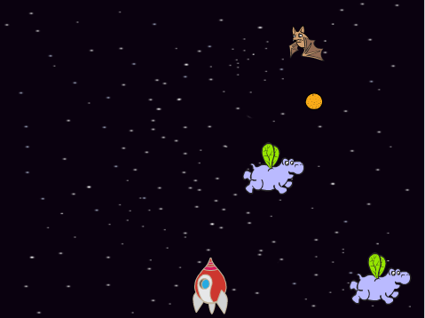

--- no-print ---

This is the **Scratch 2** version of the project. There is also a [Scratch 3 version of the project](https://projects.raspberrypi.org/nl-NL/projects/clone-wars).

--- /no-print ---

## Inleiding

In dit project leer je een spel te maken waarin je de aarde moet redden van ruimtemonsters.

### Wat ga je maken

Klik op de groene vlag in het onderstaande voorbeeld om het spel te starten en druk vervolgens op de pijltjetoets **links** en **rechts** om het ruimteschip in de **ruimte** te verplaatsen en druk op de spatiebalk om te schieten.

Scoor zoveel mogelijk punten door op de vliegende ruimte-nijlpaarden te schieten. Je verliest een leven als je wordt geraakt door een nijlpaard of door de sinaasappels die door de fruitvleermuizen worden gegooid.

  <iframe allowtransparency="true" width="485" height="402" src="https://scratch.mit.edu/projects/embed/235589789/?autostart=false" frameborder="0"></iframe>
  

### Wat ga je leren

Dit project behandelt elementen uit de volgende onderdelen van de[Raspberry Pi Digital Making Curriculum](http://rpf.io/curriculum){:target="_blank"}:

+ [Combineer programma lussen om een probleem op te lossen.](https://www.raspberrypi.org/curriculum/programming/creator){:target="_blank"}

### Aanvullende informatie voor clubleiders

Als je dit project wilt afdrukken, gebruik dan de [printvriendelijke versie](https://projects.raspberrypi.org/en/projects/clone-wars-scratch2/print){:target="_blank"} .

Gebruik de link in de voettekst om toegang te krijgen tot de GitHub-repo voor dit project, deze bevat alle bestanden (inclusief een voltooid projectvoorbeeld) in de map 'nl-NL/resources'.
