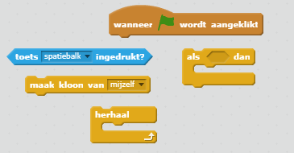

## Bliksemschichten

Laten we het ruimteschip de mogelijkheid geven bliksemschichten af ​​te vuren!

+ Voeg de `Lightning` sprite toe uit de Scratch-bibliotheek.

+ Wanneer het spel wordt gestart, moet de `Lightning` Sprite worden verborgen totdat het ruimteschip zijn laserkanonnen afvuurt, dus voeg deze code toe aan de `Lightning` sprite:

```blocks
wanneer groene vlag wordt aangeklikt 
 verdwijn
```

Op dit moment heb je een behoorlijk gigantische bliksemflits voor het ruimteschip om te vuren!

+ Voeg onder de blokken die je zojuist hebt toegevoegd een code toe om de `lightning` sprite kleiner te maken en deze om te draaien. Dan zal deze eruit zien alsof het met de punt uit het ruimteschip komt.

```blocks
maak grootte (25) %
richt naar (-90) graden
```

+ Schakel over naar de `spaceship` sprite door erop te klikken in het paneel Sprites onder het speelveld.

+ Voeg nieuwe code toe om de `spaceship` sprite een nieuwe bliksemschicht te laten maken als op de **spatie** toets wordt gedrukt.

--- hints --- --- hint --- Hier is wat mogelijke code voor je:

Wanneer op de groene vlag wordt geklikt herhaal als de **spatebalk** wordt ingedrukt, maak een kloon van de `bliksem` sprite --- /hint --- --- hint --- Dit zijn de blokken die je nodig hebt:

 --- /hint --- --- hint --- Hier is de code die je nodig hebt:

```blocks
wanneer groene vlag wordt aangeklikt
herhaal 
  als <toets [spatiebalk v] ingedrukt?> dan 
    maak kloon van [Lightning v]
  end
end
```

--- /hint --- --- /hints ---

+ Schakel terug naar de `Lightning` sprite.

+ Telkens wanneer een bliksemschicht wordt gemaakt, moet deze verschijnen en vervolgens naar boven gaan totdat deze de bovenkant van het scherm bereikt. Dan zou het moeten verdwijnen.

--- hints --- --- hint ---

Wanneer een nieuwe clone van de `bliksem` sprite verschijnt:

+ Toon deze
+ Verplaats deze herhaaldelijk met `10` naar boven totdat het de rand van het scherm raakt
+ Verwijder dan de kloon --- /hint --- --- hint --- Dit zijn de blokken die je nodig hebt:

 --- /hint --- --- hint --- Hier is de code die je moet toevoegen aan de `Lightning` sprite:

```blocks
    wanneer ik als kloon start 
   herhaal tot  <touching [edge v] ?> 
     verander  y met (10) 
   einde
   verwijder deze kloon
```

--- /hint --- --- /hints ---

+ Test je `Lightning` Sprite door op de groene vlag te klikken en vervolgens op de **spatiebalk** te drukken. Wanneer je op de **spatiebalk** drukt, verschijnt er een bliksem op het scherm? Welk probleem zie je?

--- collapse ---
---
title: Antwoord
---
Oeps - op dit moment vuurt de bliksem altijd vanaf dezelfde plek, ongeacht waar het ruimteschip is!

Voeg dit blok toe net voor het `verschijn`{:class="blocklooks"} blok om de kloon van de `Lightning` Sprite te verplaatsen naar de positie van de `spaceship` sprite voordat het verschijnt. Hierdoor zal het lijken alsof de bliksemschicht uit het ruimteschip komt.

```blocks
ga naar [Spaceship v]
```

--- /collapse ---

+ Druk op de **spatietoets** om te testen of je bliksemschicht nu correct vuurt.

--- challenge ---

### Uitdaging: de bliksemschicht repareren

Wat gebeurt er als je de **spatietoets** ingedrukt houdt? Kun je een `wacht`{:class="blockcontrol"} -blok gebruiken om dit op te lossen?

--- /challenge ---
