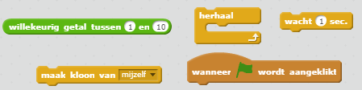

## Vliegende ruimte-nijlpaarden

Laten we heel veel vliegende nijlpaarden toevoegen die proberen je ruimteschip te vernietigen.

+ Maak een nieuwe sprite met de `Hippo1` afbeelding uit de Scratch-bibliotheek. Gebruik het **Kleiner maken** hulpmiddel om de `Hippo` Sprite net zo klein te maken als de `Spaceship` sprite.


+ Stel de `Hippo` sprite in de draaistijl zodat deze alleen links-rechts draait.

[[[generic-scratch-sprite-rotation-style]]]

+ Voeg code toe om als het spel begint de `Hippo` Sprite te verbergen.

--- hints --- --- hint --- De code hiervoor is precies hetzelfde als de code die je hebt gebruikt om de `Lightning` Sprite aan het begin van het spel te verbergen. --- /hint --- --- hint --- Dit is de code die je nodig hebt:

```blocks
wanneer groene vlag wordt aangeklikt 
 verdwijn
```

--- /hint --- --- /hints ---

+ Ga naar de stars achtergrond door te klikken op de achtergrond links onder.

+ Voeg wat code toe aan de achtergrond om elke paar seconden een nieuw nijlpaard te maken.

--- hints --- --- hint --- Wanneer op de groene vlag wordt geklikt: herhaal...

+ Wacht tussen 2 en 4 seconden
+ Maak een kloon van de hippo-sprite

--- /hint --- --- hint --- Hier is de code die je nodig hebt: 

--- /hint --- --- hint --- Hier is de code die je nodig hebt:

```blocks
wanneer groene vlag wordt aangeklikt
herhaal 
  wacht (willekeurig getal tussen (2) en (4)) sec.
  maak kloon van [Hippo1 v]
end
```

--- /hint --- --- /hints ---

+ Schakel terug naar de `Hippo` sprite.

Elke nieuw nijlpaard moet op een willekeurige x-positie verschijnen en moet een willekeurige snelheid hebben.

+ Maak een nieuwe variabele met de naam `snelheid`{:class="blockdata"} deze is alleen voor de `Hippo` sprite.

[[[generic-scratch-add-variable]]]

Je hebt dit goed gedaan als je de variabele naam van de sprite ernaast ziet staan, zoals hier:


+ Bij elke nijlpaardenkloon, kies je een willekeurige snelheid en startplaats voordat je deze op het scherm laat zien.

```blocks
wanneer ik als kloon start
maak [snelheid v] (willekeurig getal tussen (2) en (4))
ga naar x: (willekeurig getal tussen (-220) en (220)) y: (150)
verschijn
```

+ Test je code door op de groene vlag te klikken. Verschijnt er om de paar seconden een nieuwe nijlpaard? Op dit moment bewegen je nijlpaarden niet.

+ De nijlpaard moet willekeurig rondvliegen totdat hij wordt geraakt door een bliksemflits. Om dit mogelijk te maken, plak je deze code onder de blokken die je zojuist hebt toegevoegd:

```blocks
herhaal tot <raak ik [lightning v] ?> 
  neem (snelheid) stappen
  draai (willekeurig getal tussen (-10) en (10)) graden naar rechts
  keer om aan de rand
end
verwijder deze kloon
```

+ Test je hippocode. Je zou elke paar seconden een nieuwe nijlpaardkloon moeten zien verschijnen, elk met zijn eigen snelheid.
    
    

+ Test je laserkanon. Als je een nijlpaard raakt, verdwijnt die dan?
