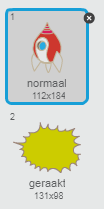

## Exploderend ruimteschip

Wanneer een nijlpaard je ruimteschip raakt, moet het schip ontploffen!

+ Selecteer de `Spaceship` sprite en hernoem het uiterlijk naar 'normaal'.

+ Teken een ander uiterlijk van een ruimteschip dat explodeert en noem het 'geraakt'.



Of, als je de explosie niet wilt tekenen, kun je het 'Sun'-kostuum uit de Scratch-bibliotheek kiezen en de **kleur een vorm** hulpmiddel gebruiken om de kleur te veranderen en het gezicht te verwijderen.


+ Voeg een code toe aan uw `Spaceship` sprite zodat het begint met het weergeven van het normaal-uiterlijk, maar wanneer het een vliegende nijlpaard raakt, schakelt het over naar het 'raak'-kostuum:

```blocks
wanneer groene vlag wordt aangeklikt
verander uiterlijk naar [normaal v] 
wacht tot <touching [Hippo1 v]>? 
verander uiterlijk naar [geraakt v]
```

+ Test je code door het spel te spelen en in botsing te komen met een nijlpaard. Verandert het ruimteschip in het 'geraakt'-kostuum?
